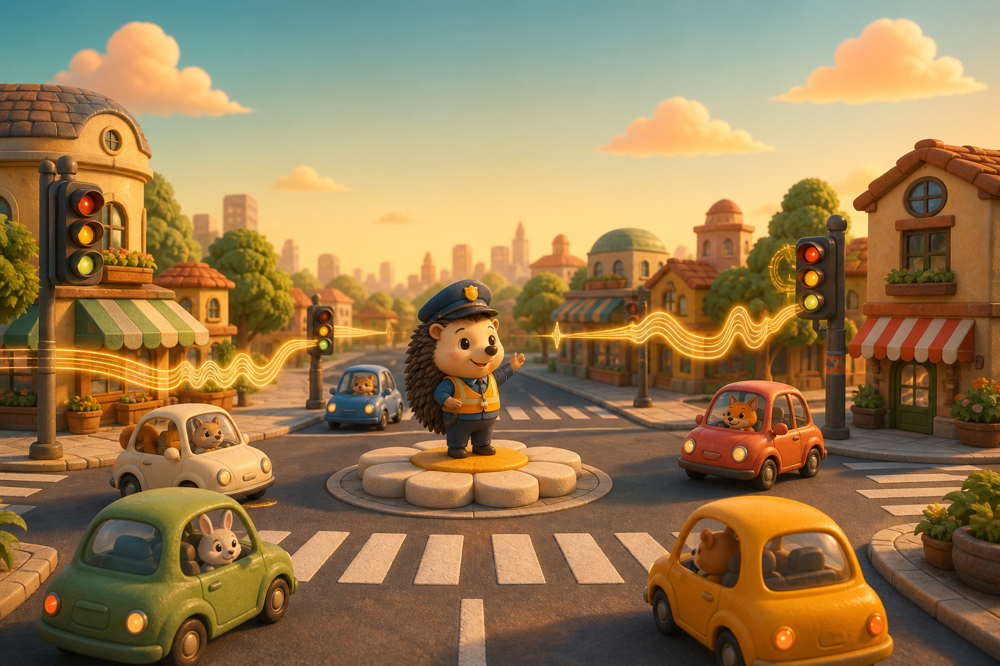

<div align="center">

# Voice Traffic Cop

### Hum low. Sing high. Keep Juniper Junction moving.

An original voice-controlled browser game where your pitch directs traffic through a cozy animal city.

[**Play in your browser**](https://voice-traffic-cop.vercel.app) · [How to play](#how-to-play) · [Run locally](#run-locally)

</div>



<div align="center">


</div>

## The game

You are the voice behind Pip Bristle, Juniper Junction's smallest traffic officer. Use the pitch and volume of a hum to switch the green light, release queues, build a streak, and keep congestion from reaching 100%.

There are no voice commands to memorize. The game listens for simple audio cues and turns them into traffic controls in real time. Audio is analyzed locally in your browser and is never uploaded or stored. Keyboard and touch controls provide a complete no-microphone way to play.

## How to play

| Make this sound | What Pip does | When to use it |
| --- | --- | --- |
| **Low hum** | Opens North–South traffic | Clear the vertical queue |
| **High hum** | Opens East–West traffic | Clear the horizontal queue |
| **Loud burst** | Stops every lane briefly | Recover from a near conflict |
| **Stable tone** | Gives the active lane a flow boost | Extend a smooth streak |

Prefer manual controls? Use **W/S or 1** for North–South, **A/D or 2** for East–West, **Space** to stop, **Shift** to boost, and **P** to pause. The same actions are available as touch buttons in the controller dock.

The first shift starts gently. Traffic gets busier as your score unlocks **Rookie Patrol**, **Cadet Crossing**, and **Captain Rush**.

> [!TIP]
> A short hum is enough to switch lanes. Watch the microphone panel to see the pitch and command currently being detected.

## What makes it different

- **Your voice is the controller** — pitch selects a lane, volume triggers an emergency stop, and tone stability creates a boost.
- **A tiny animated world** — expressive vehicles, neighborhood shops, traffic signals, and Pip all react in real time.
- **Designed to feel forgiving** — command smoothing, brief control holds, early-game grace, and gradual difficulty keep the game approachable.
- **Private by design** — microphone samples stay inside the Web Audio pipeline on your device.
- **Play your way** — switch between voice, keyboard, and touch controls during a shift.
- **A complete shift loop** — pause support, local personal bests, score streaks, traffic health, level progress, and a detailed end-of-shift report.
- **No install required** — the complete game runs in a modern browser.

## Play online

Open **[voice-traffic-cop.vercel.app](https://voice-traffic-cop.vercel.app)**, allow microphone access, and select **Play with voice**.

Microphone access requires a secure context, so use the HTTPS deployment or `localhost` during development. Headphones can help prevent your speakers from being picked up by the microphone.

## Run locally

You will need a recent version of [Node.js](https://nodejs.org/).

```bash
git clone https://github.com/Mike-Animal-Counseling/Voice-Traffic-Cop.git
cd Voice-Traffic-Cop
npm install
npm run dev
```

Then open the local URL printed by Vite and grant microphone permission.

### Production build

```bash
npm run build
npm run preview
```

## Under the hood

The microphone hook samples an `AnalyserNode`, estimates pitch with autocorrelation, smooths recent readings, and maps the result to a small command set. A second input adapter provides keyboard and touch commands through the same lane-control interface. The game loop applies either source while tracking vehicle spacing, conflict cooldowns, congestion, scoring, streaks, progression, and local records.

```text
Microphone
    ↓
Web Audio analyser → volume + pitch detection → smoothed lane command
                                                    ↓
React game loop ← scoring + congestion ← traffic simulation
```

### Project structure

```text
src/
├── game/
│   ├── constants.ts         # World dimensions and tuning values
│   ├── logic.ts             # Simulation, scoring, spawning, progression
│   └── types.ts             # Shared game types
├── hooks/
│   ├── useManualControls.ts
│   └── useMicrophoneControls.ts
├── App.tsx                  # Game scene and HUD
├── main.tsx
└── styles.css               # The complete illustrated world
```

## Roadmap

- In-game microphone calibration
- Daily challenges and shareable shift reports
- More vehicles, neighborhoods, and weather variants
- Expanded browser and microphone-device testing

## Contributing

Ideas, bug reports, and small improvements are welcome. Open an issue with your browser, operating system, microphone type, and clear reproduction steps when reporting audio-detection problems.

---

<div align="center">

Made for people who have always wanted to conduct rush hour with a hum.

</div>
